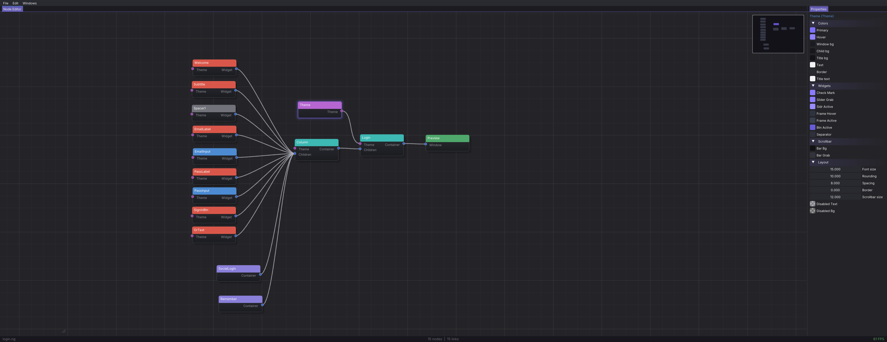
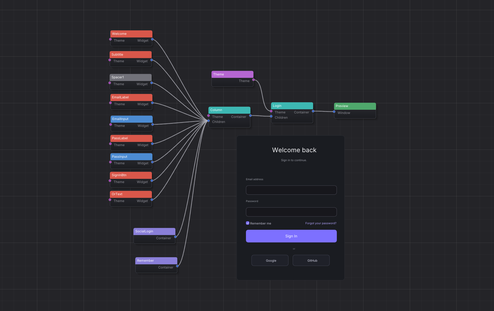
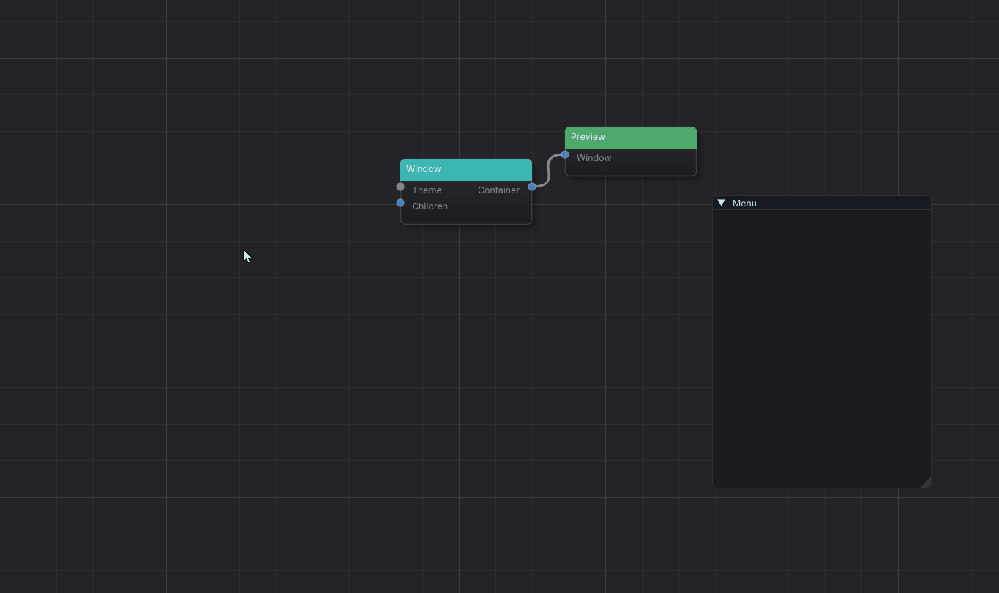

<div align="center">

# 🎨 ImGui Node Editor

**A visual node-based editor for building ImGui interfaces. No coding required.**

[]()
[]()
[]()
[]()
[]()
[]()

</div>

---

## 📸 Screenshots

---

## 📸 Screenshots

<div align="center">

<p><em>Full editor layout with a login form template</em></p>


<p><em>Live preview of the login window with themed colors</em></p>


<p><em>Animated checkbox with EaseOutBack easing</em></p>
</div>

---

## ✨ Features

| Category | Capabilities |
|----------|-------------|
| **Visual graph** | Drag, connect, and arrange nodes on an infinite canvas with smooth zoom/pan |
| **Live preview** | Real-time rendering of your UI as you build it — no compilation needed |
| **40+ node types** | Containers, widgets, inputs, menus, animations, layout helpers, and output previews |
| **Animation** | 13 easing types (bounce, elastic, back, cubic) + custom Catmull-Rom spline editor |
| **Theming** | Global ThemeNode with 20+ color controls + per-node CustomStyle overrides |
| **Components** | Reusable sub-graphs with their own canvas — double-click to enter/exit |
| **Undo/Redo** | Full undo/redo stack for all graph operations |
| **Copy/Paste** | Copy selected nodes with internal connections preserved |
| **Search & place** | Press `Space` to search and place nodes instantly |
| **Auto-arrange** | One-click topological layout for selected nodes |
| **Regions** | Color-coded grouping areas with drag/resize support |
| **File I/O** | Save/load projects as `.ng` files; import/export support |

---

## 🚀 Getting Started

### Prerequisites

- **CMake** 3.20+
- **C++17** compiler (MSVC 2022+, GCC 11+, Clang 14+)
- **OpenGL** 3.3+ capable GPU

### Build & Run

```bash
git clone --recursive https://github.com/YOUR_USER/ImGuiNodeEditor.git
cd ImGuiNodeEditor
cmake -B build
cmake --build build
./build/ImGuiNodeEditor
```

> Dependencies (GLFW, ImGui, GLAD) are vendored in `ext/` — no manual installation needed.

---

## 🧠 Architecture

```
src/
├── main.cpp              # Entry point
├── Core/
│   ├── Application       # GLFW window, ImGui context, menu bar, dockspace, live preview
│   ├── NodeFactory       # Central node registry — adding a node = registering it here
│   ├── PreviewHelpers    # Theme rendering, widget alignment, child resolution
│   └── PreviewRenderer   # Live preview dispatch (PreviewNode / NodePreviewNode)
├── NodeEditor/
│   ├── Node              # Base class: pins, serialization, properties, preview
│   ├── NodeEditor        # Canvas: interaction, pan/zoom, selection, undo/redo
│   ├── NodeEditorCanvas  # Rendering: grid, nodes, links, pins, minimap
│   └── NodeEditorActions # Search popup, context menus, clipboard
└── nodes/
    ├── containers/       # Window, Row, Column, Grid, TabBar, Child, Popup, Tree
    ├── widgets/          # Button, Checkbox, Slider, Text, InputText, ComboBox...
    ├── output/           # Preview, NodePreview
    └── style/            # ThemeNode
```

### Data Flow

```
User builds graph → NodeEditor manages nodes/links → ThemeNode styles colors →
PreviewNode picks a root → RenderHelpers::FindNodeTheme resolves theme →
RenderContext propagates to all children → each node calls RenderPreview()
```

---

## 🧩 Adding a New Node

1. Create `src/nodes/widgets/MyNode.h` and `.cpp`
2. In the constructor, define input/output pins with their types
3. Implement:
   - `RenderPreview()` — draw the widget using ImGui
   - `SaveExtra()` / `LoadExtra()` — serialize properties
   - `DrawProperties()` — show editable fields
4. Register in `NodeFactory.cpp`:
   ```cpp
   Register<MyNode>("MyNode", "What it does", "Category");
   ```

That's it. The search, palette, colors, clipboard, and serialization work automatically.

---

## 🎨 Theming System

Connect a **ThemeNode** to any container to control its look:

| Section | Fields | Affects |
|---------|--------|---------|
| **Colors** | Primary, Hover, Bg, Title, Text, Border | Windows, buttons, text |
| **Widgets** | CheckMark, SliderGrab, FrameBg, Separator | Checkboxes, sliders, inputs |
| **Scrollbar** | Bar Bg, Bar Grab | Scrollable containers |
| **Layout** | FontSize, Rounding, Spacing, Border, Scrollbar | Overall spacing and sizing |
| **Disabled** | Disabled Text/Bg | Disabled widget state |

Each node can also override these with **Custom Style** for per-instance control.

---

## 📁 Project Structure

```
├── assets/           # Fonts (Inter, Font Awesome)
├── ext/              # Vendored dependencies
├── src/              # Source code
├── CMakeLists.txt    # Build system
├── LICENSE           # Custom license
└── README.md
```

---

## 🤝 Contributing

Contributions welcome! Areas that need love:

- **Testing** — node-by-node validation
- **Documentation** — better examples and tutorials
- **New nodes** — more ImGui widgets
- **Cross-platform** — Linux/macOS testing

---

## 📄 License

Custom license — see [LICENSE](LICENSE). Free for non-commercial use.
Commercial use requires explicit permission from the author.
